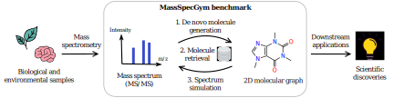
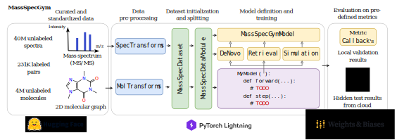

# MassSpecGym: A benchmark for the discovery and identification of molecules

<p>
  <a href="https://huggingface.co/datasets/roman-bushuiev/MassSpecGym"></a>
  <a href="https://github.com/pytorch/pytorch"> </a>
  <a href="https://github.com/Lightning-AI/pytorch-lightning"> </a>
  <a href="https://github.com/psf/black"></a>
<p>

<p align="center">
  
</p>

MassSpecGym provides three challenges for benchmarking the discovery and identification of new molecules from MS/MS spectra. The provided challenges abstract the process of scientific discovery from biological and environmental samples into well-defined machine learning problems.

<!-- [](https://huggingface.co/datasets/roman-bushuiev/MassSpecGym)   -->

📣 The paper will be available soon!

## Installation

Installation for development:

```bash
conda create -n massspecgym python=3.11
conda activate massspecgym
git clone https://github.com/pluskal-lab/MassSpecGym.git; cd MassSpecGym
pip install -e .[dev,notebooks]
```

For AMD GPUs, you may need to install PyTorch for ROCm:

```bash
pip install -U torch --index-url https://download.pytorch.org/whl/rocm6.0
```

## Codebase structure

<p align="center">
  
</p>

## Train and evaluate your model 🚀

MassSpecGym allows you to implement, train, validate, and test your model with a few lines of code. Built on top of PyTorch Lightning, MassSpecGym abstracts data preparation and splitting while eliminating boilerplate code for training and evaluation loops. To train and evaluate your model, you only need to implement your custom architecture and prediction logic.

Below is an example of how to implement a simple model based on [DeepSets](https://arxiv.org/abs/1703.06114) for the molecule retrieval task. The model is trained to predict the fingerprint of a molecule from its spectrum and then retrieves the most similar molecules from a set of candidates based on fingerprint similarity. For more examples, please see `notebooks/demo.ipynb`.

1. Import necessary modules:

```python
import torch
import torch.nn as nn
import pytorch_lightning as pl
from pytorch_lightning import Trainer

from massspecgym.data import RetrievalDataset, MassSpecDataModule
from massspecgym.data.transforms import SpecTokenizer, MolFingerprinter
from massspecgym.models.base import Stage
from massspecgym.models.retrieval.base import RetrievalMassSpecGymModel
```

2. Implement your model:

```python
class MyDeepSetsRetrievalModel(RetrievalMassSpecGymModel):
    def __init__(
        self,
        hidden_channels: int = 512,
        out_channels: int = 4096,  # fingerprint size
        *args,
        **kwargs
    ):
        """Implement your architecture."""
        super().__init__(*args, **kwargs)

        self.phi = nn.Sequential(
            nn.Linear(2, hidden_channels),
            nn.ReLU(),
            nn.Linear(hidden_channels, hidden_channels),
            nn.ReLU(),
        )
        self.rho = nn.Sequential(
            nn.Linear(hidden_channels, hidden_channels),
            nn.ReLU(),
            nn.Linear(hidden_channels, out_channels),
            nn.Sigmoid()
        )

    def forward(self, x: torch.Tensor) -> torch.Tensor:
        """Implement your prediction logic."""
        x = self.phi(x)
        x = x.sum(dim=-2)  # sum over peaks
        x = self.rho(x)
        return x

    def step(
        self, batch: dict, stage: Stage
    ) -> tuple[torch.Tensor, torch.Tensor]:
        """Implement your custom logic of using predictions for training and inference."""
        # Unpack inputs
        x = batch["spec"]  # input spectra
        fp_true = batch["mol"]  # true fingerprints
        cands = batch["candidates"]  # candidate fingerprints concatenated for a batch
        batch_ptr = batch["batch_ptr"]  # number of candidates per sample in a batch

        # Predict fingerprint
        fp_pred = self.forward(x)

        # Calculate loss
        loss = nn.functional.mse_loss(fp_true, fp_pred)

        # Calculate final similarity scores between predicted fingerprints and retrieval candidates
        fp_pred_repeated = fp_pred.repeat_interleave(batch_ptr, dim=0)
        scores = nn.functional.cosine_similarity(fp_pred_repeated, cands)

        return dict(loss=loss, scores=scores)
```

3. Train your model:

```python
# Init hyperparameters
fp_size = 4096

# Load dataset
dataset = RetrievalDataset(
    spec_transform=SpecTokenizer(n_peaks=60),
    mol_transform=MolFingerprinter(fp_size=fp_size),
)

# Init data module
data_module = MassSpecDataModule(
    dataset=dataset,
    batch_size=64
)

# Init model
model = MyDeepSetsRetrievalModel(out_channels=fp_size)

# Init trainer
trainer = Trainer(accelerator="cpu", devices=1)

# Train
trainer.fit(model, datamodule=data_module)
```

4. Test your model (the test API will be available soon):

```python
# Test
trainer.test(model, datamodule=data_module)
```

## TODO

- [x] Croissant.
- [ ] Testing API.
- [ ] Optimize de novo evaluation metrics to run in parallel by workers initialized in the corresponding pl.Module constructor
- [ ] Link to documentation.
- [ ] Link to Papers With Code leaderboard.
